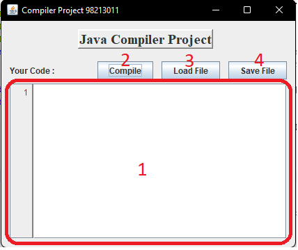
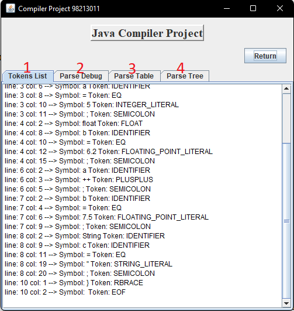

# compiler-1401
---
### Compiler Project For SUTECH 1401
This is a GUI program **JAVA** compiler based on **JAVA JFlex Scanner** and **JAVA CUP Parser**


## Codes to begin with
We can use ideal codes like to parse:
```
public void main(){

	int a = 5;
	float b = 6.2;
	// this is comment
	a++;
	b = 7.5;
	String c = "HELLO";

}
```

Or use codes with bugs like:
```
void main()
//shiraz university of technology
{
    int a = 5.8;
    String a=;
    /*
        this is sample comment
        int b='f'
        sutech = 3
    */
    String sutech = "SUTECH";
    for(a=3;a<"ali";a++)
    /*{
        a++;
        b+=3;
    }*/
    {a--;}
}
```


## GUI

When Opening Program **Main Frame** will be opened



You can write your own code in Text area **(1)** or you can open a **.txt** file via **Open Button (3)**.
Then you can compile your code with **Compile Button (4)**.
Also you can save your edited code with **Save Button (2)**.



The result of parse and lexer analyzer will be shown in this frame
**(1)** shows result of lexer analyzer
**(2)** shows result of parser
**(3)** shows Parse Table
**(4)** shows Parse Tree 